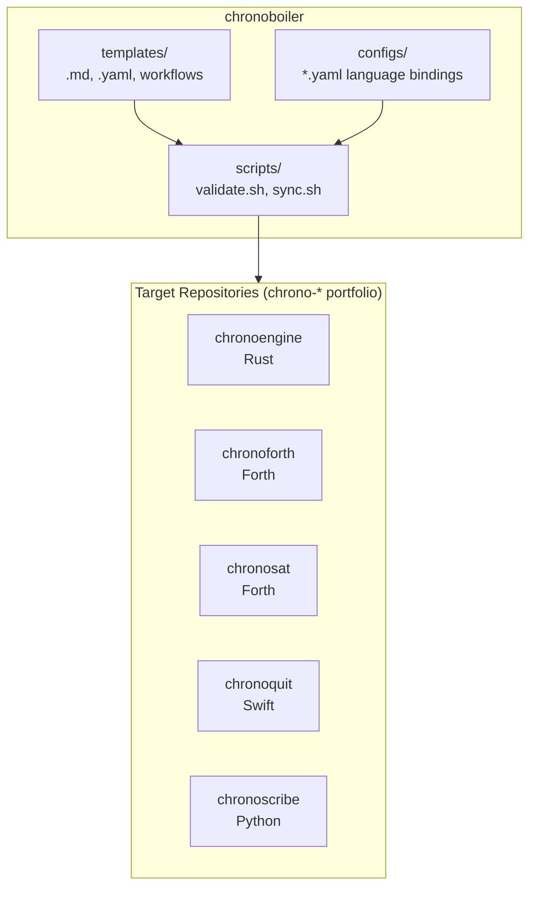
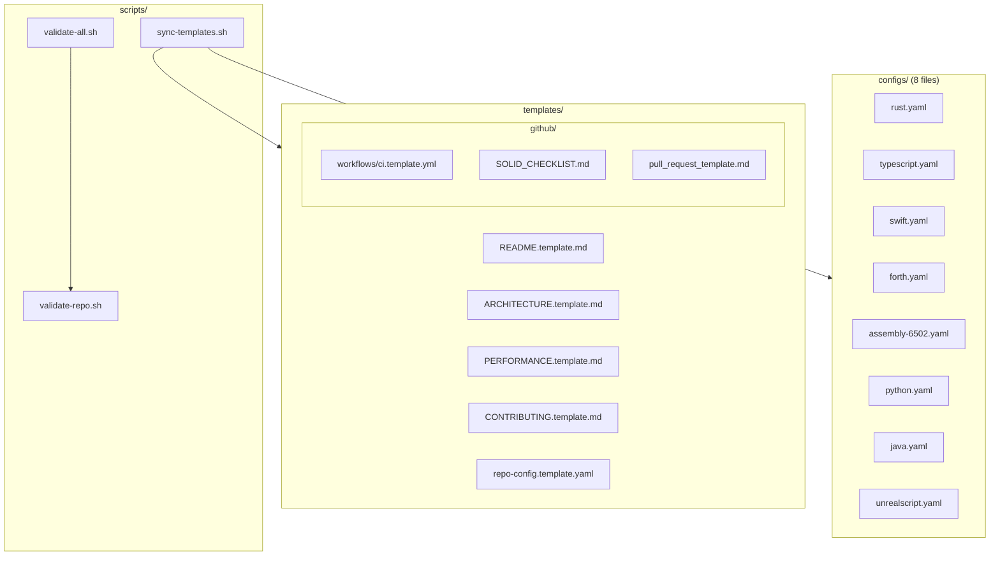
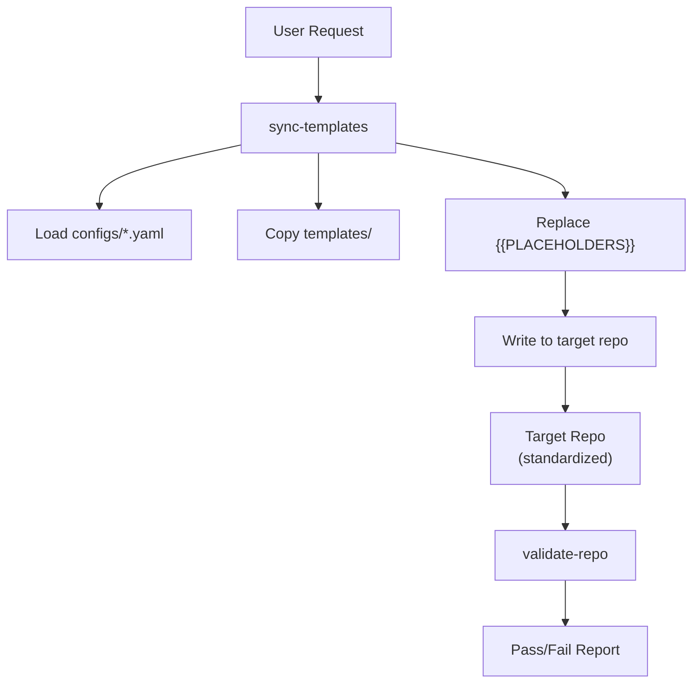

# Architecture: chronoboiler

## System Overview

Chronoboiler is a template repository that provides standardization
infrastructure for the chrono-* portfolio: shared documentation/config
templates, per-language YAML configs, and three bash scripts (plus one optional
zsh linter) that copy templates into a target repo and validate a repo against
the expected structure. It is data (templates + configs) plus thin bash tooling,
not a long-running service.

### Component Diagram



## Component Breakdown

### Component 1: Templates

**File Location:** `templates/`
**Responsibility:** Provide copy-paste-ready documentation and configuration
**Inputs:** None (static content)
**Outputs:** Template files with `{{PLACEHOLDER}}` syntax
**Dependencies:** None

Templates use a consistent placeholder format:

- Double braces: `{{VARIABLE_NAME}}`
- SCREAMING_SNAKE_CASE for variable names
- Self-documenting variable names

### Component 2: Scripts

**File Location:** `scripts/`
**Responsibility:** Automate validation and template deployment
**Inputs:** Repository paths, language configurations
**Outputs:** Validation reports, populated template files
**Dependencies:** bash 4.0+, optional yq for YAML parsing

Key scripts:

- `validate-repo.sh`: Check single repo compliance
- `validate-all.sh`: Batch validation
- `sync-templates.sh`: Template deployment

### Component 3: Language Configs

**File Location:** `configs/`
**Responsibility:** Map languages to CI/CD specifics
**Inputs:** None (static configuration)
**Outputs:** YAML configuration consumed by scripts
**Dependencies:** None

All eight files currently in `configs/`. The language is each config's
`language.name`; the intended consumer is illustrative, not recorded in the
configs (see README for the caveat that no sibling repo declares chronoboiler as
its source).

| Config | Language (`language.name`) | Illustrative consumer |
|--------|----------------------------|-----------------------|
| rust.yaml | Rust | chronoengine (Rust) |
| typescript.yaml | TypeScript | (TypeScript repo) |
| assembly-6502.yaml | 6502 Assembly | retro / embedded |
| forth.yaml | Forth | chronosat, chronoforth (both Forth) |
| swift.yaml | Swift | chronoquit (Swift) |
| python.yaml | Python | chronoscribe (Python) |
| java.yaml | Java | (Java repo) |
| unrealscript.yaml | UnrealScript | game mod |

### Component 4: CI/CD Workflows

**File Location:** `.github/workflows/`
**Responsibility:** Self-validate chronoboiler templates and scripts
**Inputs:** Git push/PR events
**Outputs:** Pass/fail status, validation reports
**Dependencies:** GitHub Actions runners

## SOLID Principles Applied

| Principle | Implementation |
|-----------|----------------|
| **S** (Single Responsibility) | Each script does one thing |
| **O** (Open/Closed) | New languages added via configs, not script modification |
| **L** (Liskov Substitution) | All language configs are interchangeable |
| **I** (Interface Segregation) | Scripts accept minimal required arguments |
| **D** (Dependency Inversion) | Scripts depend on config structure, not specific languages |

## Dependency Graph



## Scalability Characteristics

| Scale | Bottleneck | Mitigation |
|-------|------------|------------|
| 1-10 repos | None | Direct script invocation |
| 10-50 repos | Script execution time | Parallel validation |
| 50+ repos | Maintenance overhead | Consider automation |

## Trade-Offs

### Decision 1: Bash Scripts Over Node/Python CLI

**Rationale:** Zero dependencies beyond bash; works on any Unix system
**Pros:** Portable, no package installation required, fast startup
**Cons:** Less structured than a proper CLI framework
**Alternative Considered:** Node.js CLI with commander.js

### Decision 2: {{PLACEHOLDER}} Format Over Jinja2

**Rationale:** Simple regex replacement, no template engine dependency
**Pros:** Works with sed, grep, any text editor; self-documenting
**Cons:** No conditionals, loops, or complex logic
**Alternative Considered:** Jinja2, Handlebars, envsubst

### Decision 3: YAML Configs Over JSON

**Rationale:** Human-readable, supports comments, standard for CI/CD
**Pros:** Easier to edit, comments document intent, GitHub Actions native
**Cons:** Whitespace-sensitive, requires parser
**Alternative Considered:** JSON, TOML

## Data Flow



## Target Repository Structure

After standardization, each target repository contains:

```text
repository/
├── README.md              # From template
├── ARCHITECTURE.md        # From template
├── PERFORMANCE.md         # From template
├── CONTRIBUTING.md        # From template
├── repo-config.yaml       # From template
├── LICENSE                # Per the target repo (chronoboiler itself is Apache-2.0)
├── .editorconfig          # Universal
├── .gitignore             # Merged
├── .gitattributes         # Universal
└── .github/
    ├── SOLID_CHECKLIST.md
    ├── pull_request_template.md
    └── workflows/
        └── ci.yml         # Language-specific
```

---

*Standardized with [chronoboiler](https://github.com/the-chronomancer/chronoboiler) v1.0.0*
