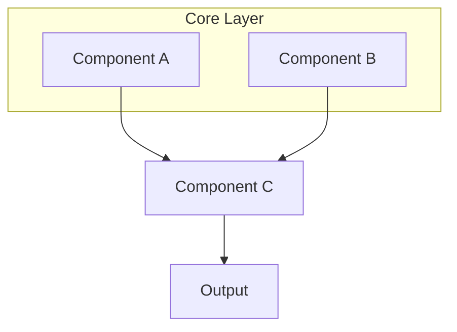
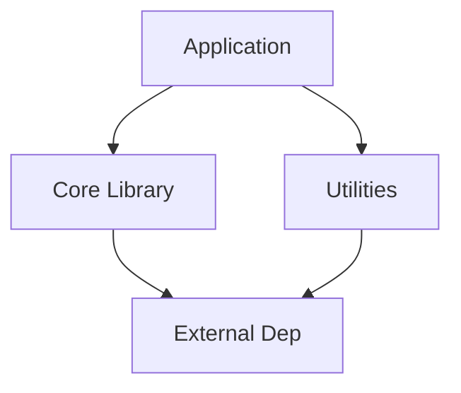
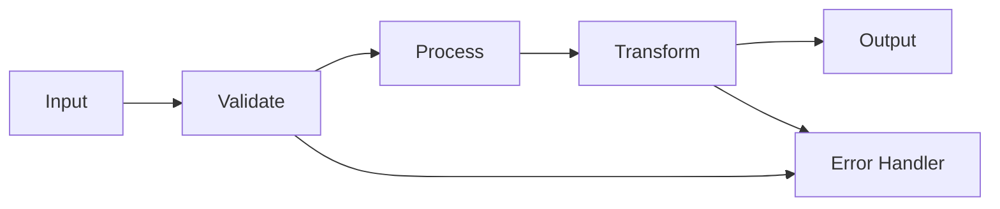

# Architecture: {{PROJECT_NAME}}

## System Overview

{{SYSTEM_OVERVIEW_DESCRIPTION}}

### Component Diagram

```mermaid
graph TB
    {{COMPONENT_DIAGRAM_MERMAID}}
```

<!-- Example Mermaid diagram:

-->

## Component Breakdown

### Component 1: {{COMPONENT_1_NAME}}

**File Location:** `{{COMPONENT_1_PATH}}`
**Responsibility:** {{COMPONENT_1_RESPONSIBILITY}}
**Inputs:** {{COMPONENT_1_INPUTS}}
**Outputs:** {{COMPONENT_1_OUTPUTS}}
**Dependencies:** {{COMPONENT_1_DEPENDENCIES}}

```{{LANGUAGE}}
{{COMPONENT_1_INTERFACE_CODE}}
```

### Component 2: {{COMPONENT_2_NAME}}

**File Location:** `{{COMPONENT_2_PATH}}`
**Responsibility:** {{COMPONENT_2_RESPONSIBILITY}}
**Inputs:** {{COMPONENT_2_INPUTS}}
**Outputs:** {{COMPONENT_2_OUTPUTS}}
**Dependencies:** {{COMPONENT_2_DEPENDENCIES}}

```{{LANGUAGE}}
{{COMPONENT_2_INTERFACE_CODE}}
```

<!-- Add more components as needed -->

## SOLID Principles Applied

| Principle | Implementation |
|-----------|----------------|
| **S** (Single Responsibility) | {{SOLID_S_IMPLEMENTATION}} |
| **O** (Open/Closed) | {{SOLID_O_IMPLEMENTATION}} |
| **L** (Liskov Substitution) | {{SOLID_L_IMPLEMENTATION}} |
| **I** (Interface Segregation) | {{SOLID_I_IMPLEMENTATION}} |
| **D** (Dependency Inversion) | {{SOLID_D_IMPLEMENTATION}} |

## Dependency Graph

```mermaid
graph TD
    {{DEPENDENCY_GRAPH_MERMAID}}
```

<!-- Example Mermaid dependency graph:

-->

## Scalability Characteristics

| Scale | Bottleneck | Mitigation |
|-------|------------|------------|
| Small (< {{SMALL_THRESHOLD}}) | {{SMALL_BOTTLENECK}} | {{SMALL_MITIGATION}} |
| Medium ({{SMALL_THRESHOLD}}-{{MEDIUM_THRESHOLD}}) | {{MEDIUM_BOTTLENECK}} | {{MEDIUM_MITIGATION}} |
| Large (> {{MEDIUM_THRESHOLD}}) | {{LARGE_BOTTLENECK}} | {{LARGE_MITIGATION}} |

## Trade-Offs

### Decision 1: {{DECISION_1_NAME}}

**Rationale:** {{DECISION_1_RATIONALE}}
**Pros:** {{DECISION_1_PROS}}
**Cons:** {{DECISION_1_CONS}}
**Alternative Considered:** {{DECISION_1_ALTERNATIVE}}

<!-- Add more decisions as needed -->

### Decision 2: {{DECISION_2_NAME}}

**Rationale:** {{DECISION_2_RATIONALE}}
**Pros:** {{DECISION_2_PROS}}
**Cons:** {{DECISION_2_CONS}}
**Alternative Considered:** {{DECISION_2_ALTERNATIVE}}

## Data Flow

```mermaid
flowchart LR
    {{DATA_FLOW_MERMAID}}
```

<!-- Example Mermaid data flow:

-->

---

*Standardized with [chronoboiler](https://github.com/the-chronomancer/chronoboiler) v{{CHRONOBOILER_VERSION}}*
